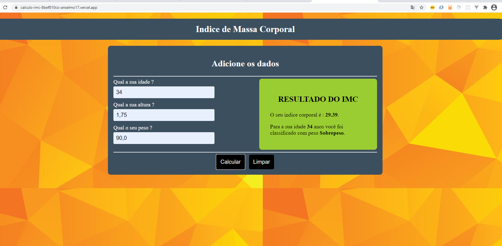

# Calculadora Massa Corporal Imc

## Instalar as dependencias
npm install

## Rodar o projeto local
npm start
Run `ng serve` for a dev server. Navigate to `http://localhost:4200/`. The app will automatically reload if you change any of the source files.

This project was generated with [Angular CLI](https://github.com/angular/angular-cli) version 8.3.29.

## Build
Run `ng build` to build the project. The build artifacts will be stored in the `dist/` directory. Use the `--prod` flag for a production build.

## Running unit tests

Run `ng test` to execute the unit tests via [Karma](https://karma-runner.github.io).

## Link do projeto
[Calculadora de Massa corporal](https://calculo-imc-8bef810co-anselmo17.vercel.app/)